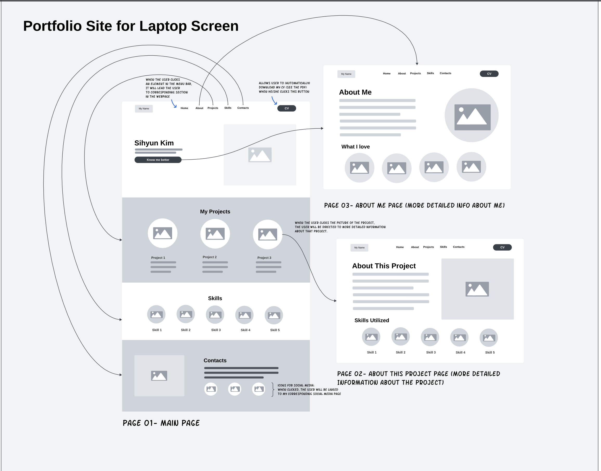
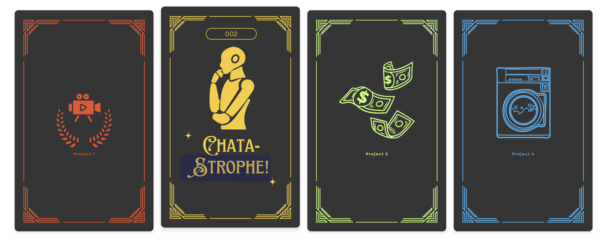
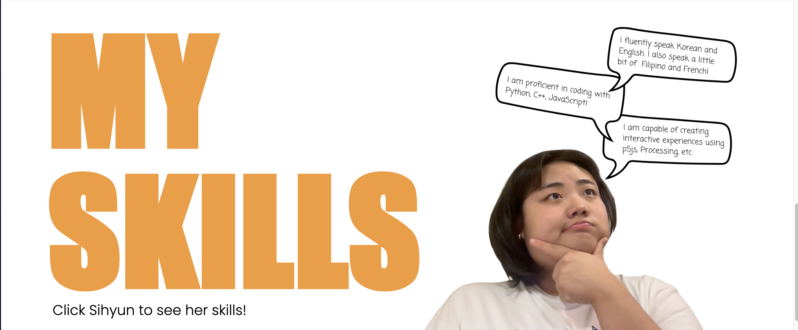

# **SIHYUN!**

## **Project Description**
“SIHYUN!” is a personal portfolio website designed to showcase my creative and technical skills. The concept focuses on creating an engaging and user-friendly experience that effectively communicates “who I am” through a visually appealing and straightforward layout. My goal was to ensure the website is visually appealing, professional, and straightforward, delivering essential information efficiently while maintaining a clean, catchy, and modern aesthetic.

---

## **Process**
### **Inspiration and Planning**
To start, I explored various portfolio examples on Brightspace. Among them, I found Mina Kim's and Jason Xia's websites particularly well-made due to their clean and minimalistic design. Inspired by their approaches, I aimed to create a website that effectively communicates my skills and projects without overwhelming users with unnecessary elements.

### **Wireframing and Structure**
After settling on a clean and minimalistic theme, I created a wireframe for the website, structuring it into five main sections:
- **Home**
- **About**
- **Projects**
- **Skills**
- **Contacts**

While most sections were included on the landing page, I decided to create a separate About page to spark curiosity about me and allow the landing page to provide a concise overview of essential information.

### **Design and Development**
1. **HTML and CSS:**
   - Built the general HTML structure, focusing on navigation and content organization.
   - Used Canva to experiment with fonts, colors, and layouts to ensure a cohesive and modern aesthetic.
   - Styled the website with CSS, adding consistent typography, spacing, hover effects, and subtle transitions to enhance interactivity while maintaining simplicity.

2. **JavaScript Features:**
   - **Smooth Scrolling for Navigation:** Users can click a link to navigate seamlessly to the corresponding section.
   - **Dynamic Project Cards:** Hovering over a project card reveals its title, and clicking it directs users to the project link.
   - **Interactive Skills Section:** Clicking on the skills image cycles through visuals representing different skills.
   - **Download CV Button:** A button opens my CV in a new tab for easy access.
   - **Navigation to About Page:** A seamless transition to the About page from the landing page.

### **Debugging and Challenges**
Throughout development, I encountered challenges, particularly with implementing flipping project cards. Debugging tools and ChatGPT were instrumental in resolving these issues.

---

## **Reflection/Evaluation**
The final website evolved significantly from the initial wireframe, staying true to the clean and minimalistic concept while incorporating dynamic and engaging elements:

*Initial Wireframe*

### **Projects Section:** 

I initially just thought of making the projects section very typical, with an image in a circle and the title of the project below the image. When clicked, it was supposed to lead to a specific project page with a lengthy description and a link to the real project. However, I realized that this design was too plain and lacked engagement. Moreover, requiring users to go through two steps just to view a project felt unnecessarily redundant and could detract from the user experience.

To address this, I streamlined the design and functionality of the section. Instead of the original design I thought of, I designed the project cards to show the project name directly on the card when the cursor is on the card. Now, when users interact with a project card, the project title appears dynamically, and if clicked again, they are directly directed to the project link. This simplified interaction ensures that users can access the project quickly and intuitively, without unnecessary steps.

This redesign made the projects section more user-friendly and engaging, aligning with the minimalist and efficient approach of the overall website. By keeping the interaction straightforward while maintaining visual appeal, I was able to improve both the functionality and the aesthetic of the projects section.

*Project Section* 

### **Skills Section:** Initially, I planned to simply list my skills with corresponding icons or images in a grid format. While this approach was straightforward, I felt it lacked interactivity and didn’t fully reflect the creative aspects of my work.

To make the section more engaging, I implemented a feature where the displayed image changes each time it is clicked. Instead of static icons, users interact with a single image that cycles through different visuals representing my various skills. This dynamic interaction adds a layer of playfulness and curiosity, making the section more memorable and enjoyable for users.

This change allowed me to present my skills in a way that is not only visually appealing but also interactive, aligning with the overall goal of making my portfolio both functional and engaging. The final design effectively communicates my abilities while adding a unique and creative touch to the website.

*Skills Section*

### **Conclusion**
I believe my goals and expectations for this project were fully met. The final website balances simplicity with interactivity, creating a professional and engaging portfolio. Key improvements to the Projects and Skills sections significantly enhanced the user experience while maintaining the website’s cohesive and minimalistic aesthetic. This project was a valuable learning experience, refining my skills in design, development, and problem-solving.
